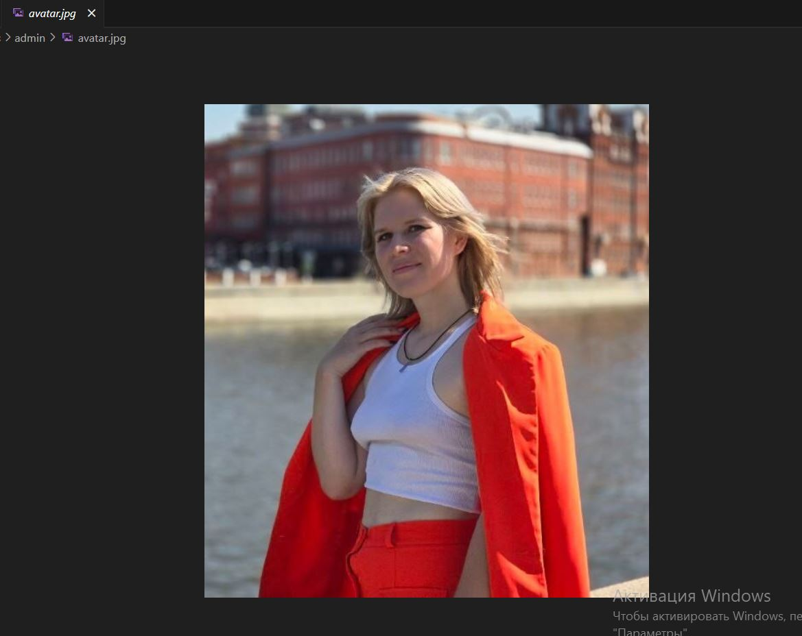
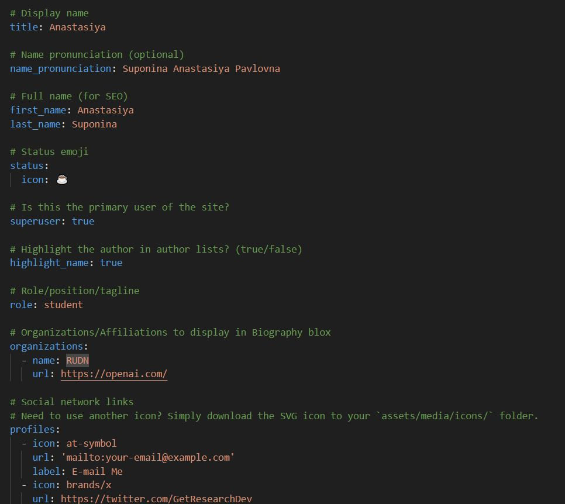
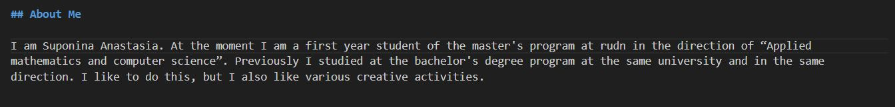
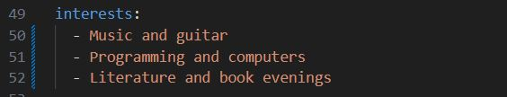
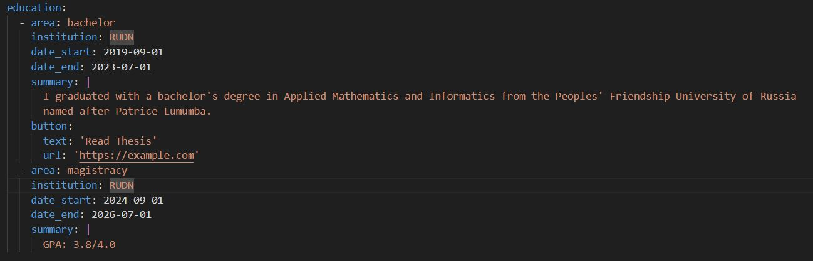
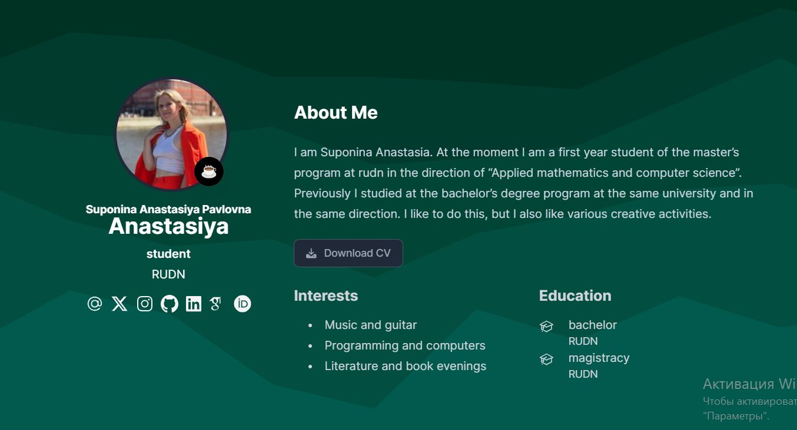
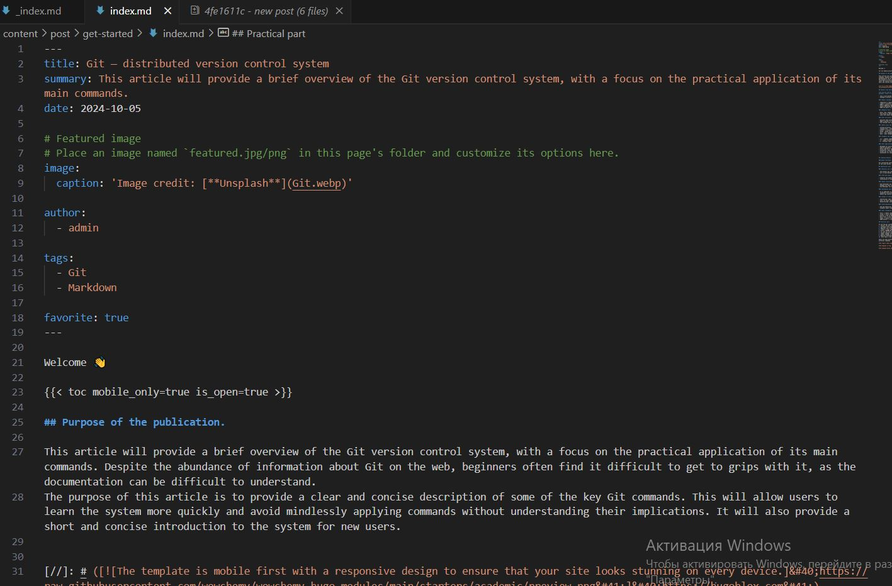
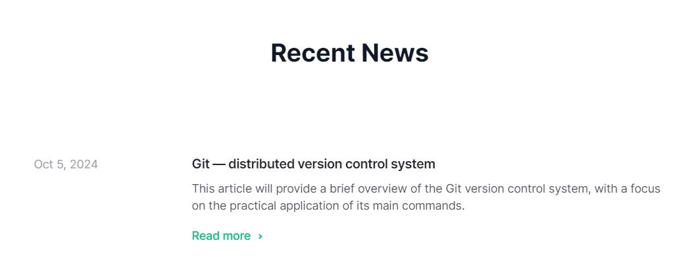

---
## Front matter
lang: ru-RU
title: Научное программирование
author: Супонина Анастасия Павловна
institute: РУДН, Москва, Россия

date: 5 Октября 2024

## Formatting
toc: false
slide_level: 2
theme: metropolis
header-includes: 
 - \metroset{progressbar=frametitle,sectionpage=progressbar,numbering=fraction}
 - '\makeatletter'
 - '\beamer@ignorenonframefalse'
 - '\makeatother'
aspectratio: 43
section-titles: true
---

# Индивидуальная лабораторная работа 2

## Размещение новой фотографии.

{ #fig:001 width=70% }

## Размещение краткого описания (Biography).

{ #fig:009 width=70% }
{ #fig:009 width=70% }

## Добавление информации о интересах (Interests).

{ #fig:002 width=70% }

## Добавление информации об образовании (Education).

{ #fig:002 width=70% }

## Результат обновления информации.

{ #fig:002 width=70% }

## Создание нового поста "Управление версиями. Git."

{ #fig:002 width=70% }

## Отображение данных о посте на главной странице

{ #fig:002 width=70% }

## Отображение поста при переходе по ссыле на сайте

{ #fig:002 width=70% }

## Выводы

- научилась редактировать личную инфомацию на сайте
- менять фотографию на сайте
- публиковать новые посты

## {.standout}

Спасибо за внимание!

## Добавление поста

