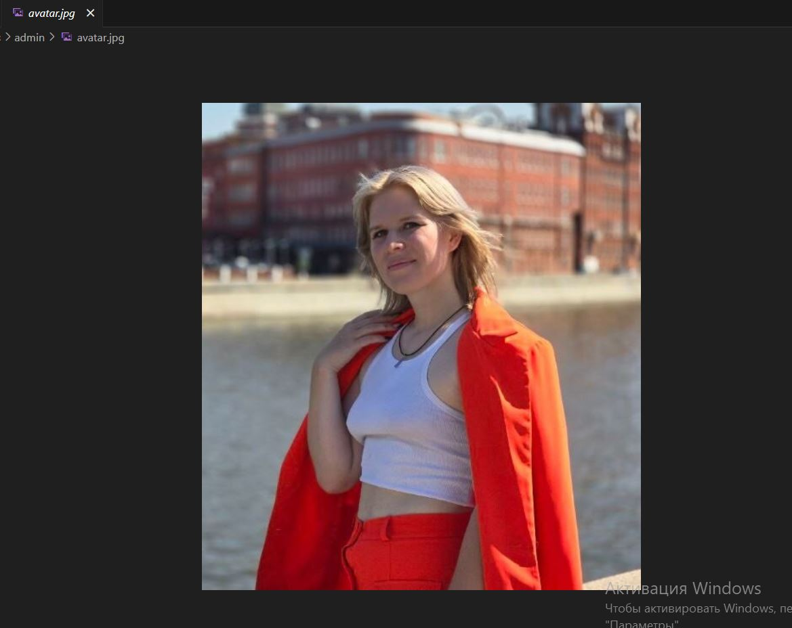
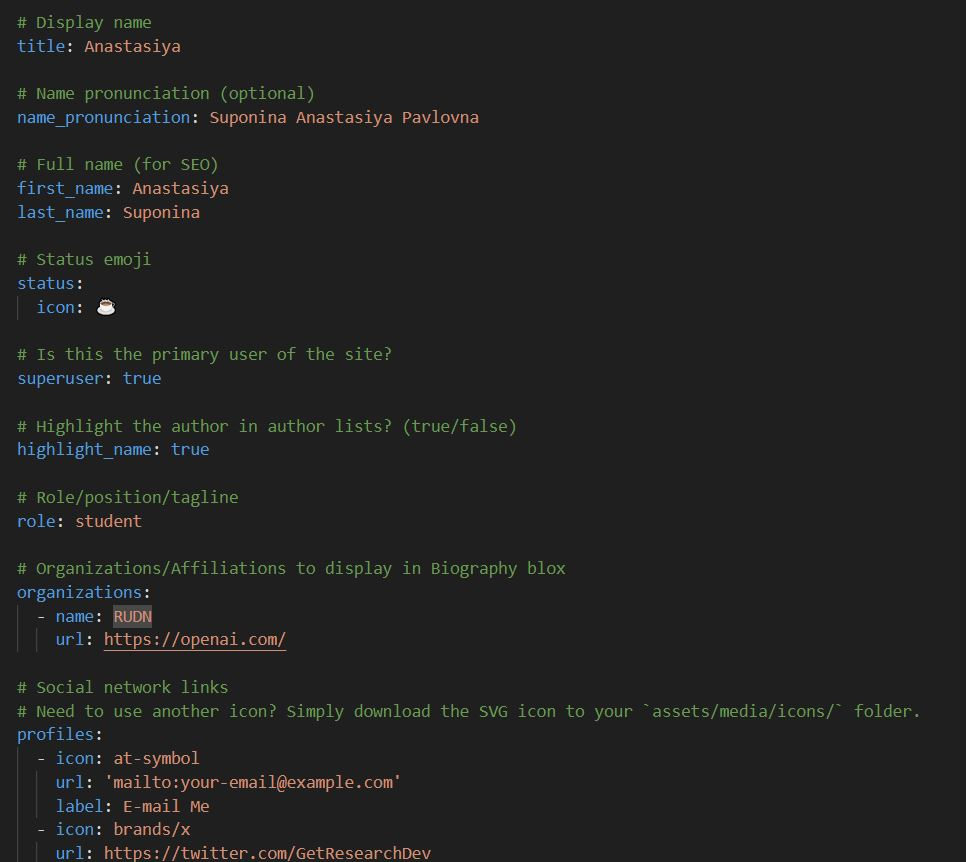
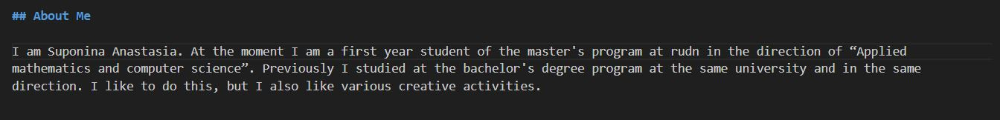
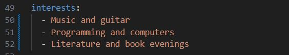
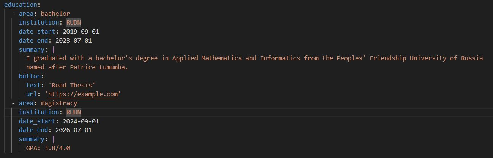
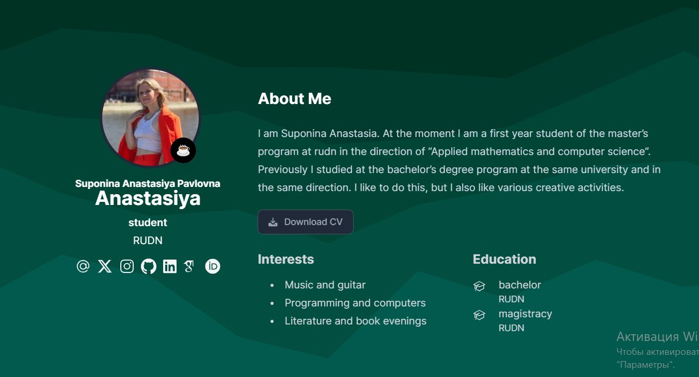
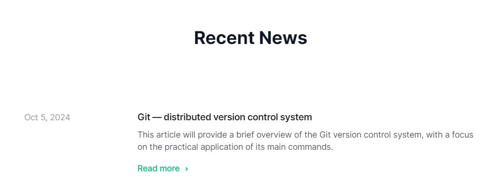

---
## Front matter
title: "Отчёт по индивидуальной лабораторной работе 2"
author: "Супонина Анастасия Павловна"

## Generic otions
lang: ru-RU
toc-title: "Содержание"

## Bibliography
bibliography: bib/cite.bib
csl: pandoc/csl/gost-r-7-0-5-2008-numeric.csl

## Pdf output format
toc: true # Table of contents
toc-depth: 2
lof: true # List of figures
lot: true # List of tables
fontsize: 12pt
linestretch: 1.5
papersize: a4
documentclass: scrreprt
## I18n polyglossia
polyglossia-lang:
  name: russian
  options:
  - spelling=modern
  - babelshorthands=true
polyglossia-otherlangs:
  name: english
## I18n babel
babel-lang: russian
babel-otherlangs: english
## Fonts
mainfont: IBM Plex Serif
romanfont: IBM Plex Serif
sansfont: IBM Plex Sans
monofont: IBM Plex Mono
mathfont: STIX Two Math
mainfontoptions: Ligatures=Common,Ligatures=TeX,Scale=0.94
romanfontoptions: Ligatures=Common,Ligatures=TeX,Scale=0.94
sansfontoptions: Ligatures=Common,Ligatures=TeX,Scale=MatchLowercase,Scale=0.94
monofontoptions: Scale=MatchLowercase,Scale=0.94,FakeStretch=0.9
mathfontoptions:
## Biblatex
biblatex: true
biblio-style: "gost-numeric"
biblatexoptions:
  - parentracker=true
  - backend=biber
  - hyperref=auto
  - language=auto
  - autolang=other*
  - citestyle=gost-numeric
## Pandoc-crossref LaTeX customization
figureTitle: "Рис."
tableTitle: "Таблица"
listingTitle: "Листинг"
lofTitle: "Список иллюстраций"
lotTitle: "Список таблиц"
lolTitle: "Листинги"
## Misc options
indent: true
header-includes:
  - \usepackage{indentfirst}
  - \usepackage{float} # keep figures where there are in the text
  - \floatplacement{figure}{H} # keep figures where there are in the text
---

# Цель работы

Провести работу с ранее созданным сайтом. Научится добавлять и изменять данные о себе. Научиться создавать новые посты на сайте.

# Задание - добавить к сайту данные о себе.

## Список добавляемых данных.

- Разместить фотографию владельца сайта.
- Разместить краткое описание владельца сайта (Biography).
- Добавить информацию об интересах (Interests).
- Добавить информацию от образовании (Education).

## Сделать пост по прошедшей неделе.

Добавить пост на тему по выбору:
- Управление версиями. Git.
- Непрерывная интеграция и непрерывное развертывание (CI/CD).

# Выполнение работы

## Я начала работу с добавления данных о себе.

Используя VScode и установленный в него GitHub Pull Request начала редактировать данные о себе открыв документ C:\Users\bermu\Desktop\Сайт\SuponinaAP.github.io\content\authors\admin\_index.md.

Первым делом разместила новый файл avatar.jpg со своеё фотографией.

Далее разместила своё краткое описание (Biography).

Добавила информацию о своих интересах (Interests).

И добавила информацию об образовании (Education).

После зашла и проверила изменение на странице сайта, для того, чтобы проверить результат

## Добавление поста

Далее я перешла к созданию нового поста и его публикации.
Для поста я выбрала тему "Управление версиями. Git."

И также как и ранее после добавления изменений в репозиторий, зашла на страницу сайта где нашла опубликованный пост

И перейдя по ссылке проверила результат отображения написанного поста

# Выводы

В результате проделанной работы я научилась редактировать личную инфомацию на сайте, менять фотографию, а также публиковать новые посты. 

